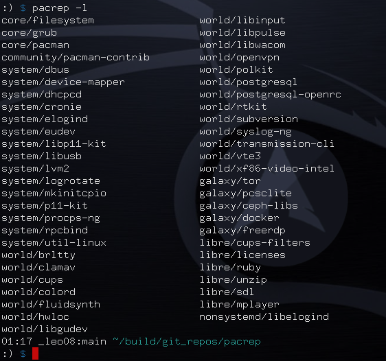

# PacRep
> Choose pacman repositories on a per package basis

Example image of `pacrep` rules. Here I am using repositories coming from Artix (system, world, and galaxy) to get rid of systemd (using instead OpenRC), Parabola (libre) to get free/libre packages not found in Arch offical repositories, and Arch itself, of course, to preserve Arch Linux identity. All packages not listed here are installed as usual from Arch repositories.

## Description

This script takes basically two options: -a, to update and upgrade the entire system, and -s, to install single packages. Once it knows what is to be installed/upgraded, it checks every package against a rules list (a series of lines in the form "repo/pkg" defined in the configuration file), and, if a rule for the package is found, it installs the package from the specified repository (instead of from the first repository defined in `/etc/pacman.conf` providing the package, which is pacman's default behaviour).

The main idea of this script is to make `pacman` able to handle packages with the same name in different repositories, for example, "core/licenses" and "libre/licenses" or "extra/nmap" and "blackarch/nmap", without the need to explicitly specify the repository in the command line, besides the important fact that it works for upgrades as well. Just define in the configuration file from which repository a certain package is to be installed/upgraded and `pacman` will always install/upgrade the package from the specified repository (disregarding the repositories order in `/etc/pacman.conf`). In this way, we can use packages and repositories coming from different Arch based distributions more easily and smoothly.

## A side note

though `pacrep` can work as a standalone program, it was originally intended to wortk together with two other programs: `isfree` (see https://github.com/leo-arch/isfree) and `pacfree` (see https://github.com/leo-arch/pacfree). The three together form part of a bigger project: making `pacman` and `Archlinux` even more free.
